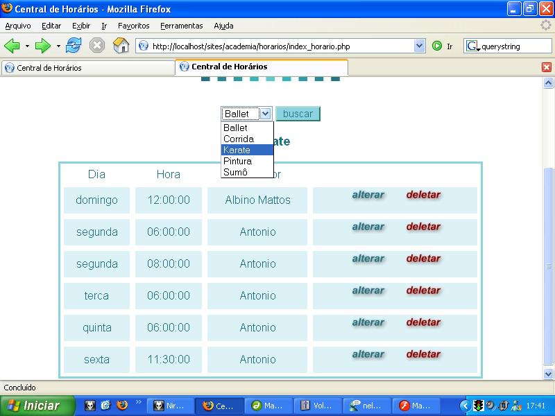

# Sistema de Gestão de Academia - PHP App - 2006
by Francisco Mat

Manage gym classes and teachers online, with a news system. Project stopped, never used.

My first full PHP/Javascript system, made from scratch, with exclusive design.

My second canceled job, lost work and time. My client would try to resell the system, but he canceled the project without any sales.

If you are intersted came in and help me finish this job.

# Installation instructions
Copy logaracademia-example and rename it to logaracademia.php, and change credentials

For admin access you need to change credentials in index.php. Default login and user:
* User: gym_master
* Pass: dg2486

## Português Brasil
Sistema em PHP criado sob medida para um cliente revender para academia, o desenvolvimento foi interrompido antes do trabalho ser concluído.

O projeto era a criação de um sistema online para o controle de academias, com módulos para horários, notícias, alunos e professores.

Se houver algum interessado ou oportunidade vou continuar o desenvolvimento do sistema, pois está bem documentado, faltando apenas o corrigir alguns bugs e adicionar algumas funcionalidades.